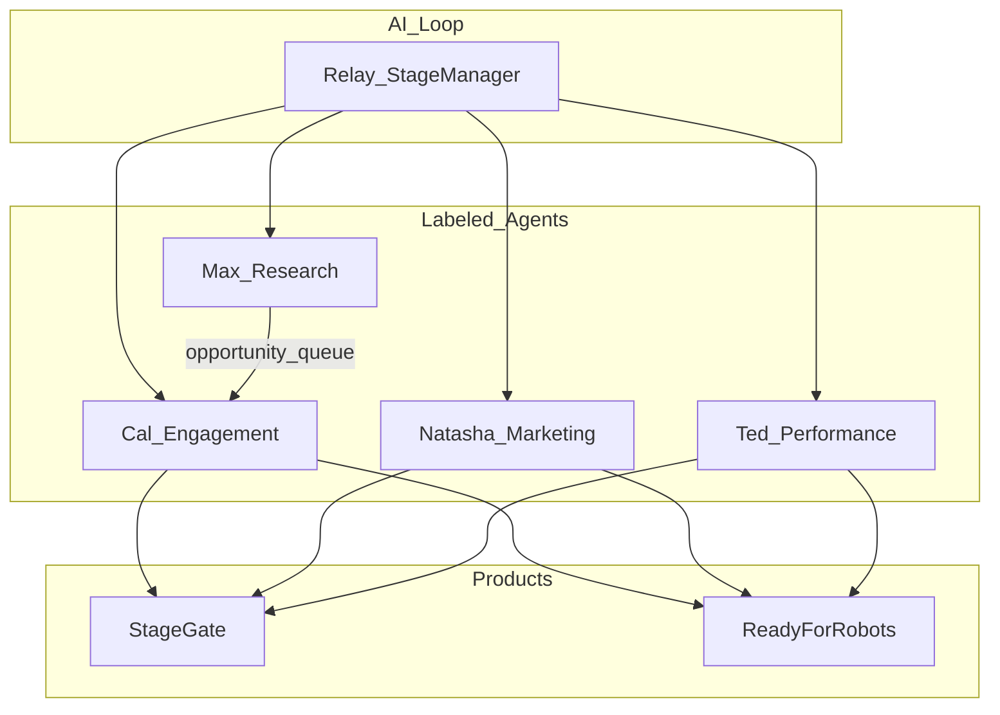

# AI Organization — StageGate & ReadyForRobots

One AI org spans both products. **Relay** is the loop (Stage Manager). Labeled workers do the work.

## North star

Move anonymous visitors → signed-up users → paying customers.

- **StageGate:** demo booked / quote paid
- **ReadyForRobots:** signup → first saved lead → paid tier

## Agent charters

| Agent | Talks to | Owns | Success | Status |
|-------|----------|------|---------|--------|
| **Relay** | Systems, cron, DB | Observe→Act→Verify→Notify; priority stack; daily digest | Loop green; conversion up | Live |
| **Cal** | Humans (email) | Outreach, replies, engagement | Replies, meetings, activation | Live |
| **Max** | Apollo, Hunter, RSS, RFR OEMs, scrapers | Find/score opportunities; enrich; hand off to Cal | Fresh, sendable pipeline for Cal | Live |
| **Natasha** | Product / UX surfaces | Signup funnels, marketing experiments, UI conversion | Signups / activation rate | Live |
| **Ted** | Runtime metrics | Perf, Core Web Vitals, error budgets, deploy / cron health | Faster pages, fewer regressions | Live |

Cal’s **voice is consistent** across brands. Product context may differ; identity does not.

**Naming:** Max is the research agent only. StageHand™ on-site support is led by **Sam** (customer-facing), not Max.

## Max → Cal handoff

Max’s durable output is `prospects` + `prospect_research` + Hunter enrichment.

**Ready for Cal** = high/verified personal email, not suppressed, website on file, not already drafted / terminal.

Code: `listMaxReadyForCal()` in `server/agents/aiOrg.ts`. Relay’s “outreach motion” and Cal operator consume this queue.

## Natasha → growth surface

Natasha observes signup funnel metrics (users, newsletter, company profiles, demos, quotes) and produces a growth brief: social posts, newsletter hooks, UI experiments, signup nudges.

Code: `runNatashaCycle()` / `executeNatashaRun()` in `server/agents/natashaOperator.ts`. Invoked from Relay and cron `/api/scheduled/natasha-operator`.

## Ted → loop health

Ted observes cron registration, bounce circuit breaker, API key presence, and recent failed/stale agent runs. He grades the loop (green / yellow / red) and emits recommendations.

Code: `runTedCycle()` / `executeTedRun()` in `server/agents/tedOperator.ts`. Invoked from Relay observe step and cron `/api/scheduled/ted-operator`.

## Cron ownership

| Endpoint | Schedule (UTC) | Owner |
|----------|----------------|-------|
| `/api/scheduled/sales-agent-discover` | 02:00 | Max |
| `/api/scheduled/sales-agent-ingest` | 03:00 | Max |
| `/api/scheduled/rss-intelligence` | 04:00 | Max |
| `/api/scheduled/enrich-contacts` | 05:00 | Max |
| `/api/scheduled/nightly-research` | (registered) | Max |
| `/api/scheduled/quote-followup` | 09:00 | Cal |
| `/api/scheduled/cal-operator` | 10:00, 22:00 | Cal (+ Max enrich inside cycle) |
| `/api/scheduled/natasha-operator` | 11:00 | Natasha |
| `/api/scheduled/ted-operator` | 12:00 | Ted |
| `/api/scheduled/relay-loop` | 10:30, 22:30 | Relay |
| `/api/scheduled/sales-agent-outreach` | 14:00, 18:00 | Cal |

## Registry

Canonical code registry: `server/agents/aiOrg.ts` (`AI_AGENTS`). Shared metadata: `shared/aiOrg.ts`. Admin UI: `/admin/agents`.

See also [`docs/relay_charter.md`](relay_charter.md).

— Relay
